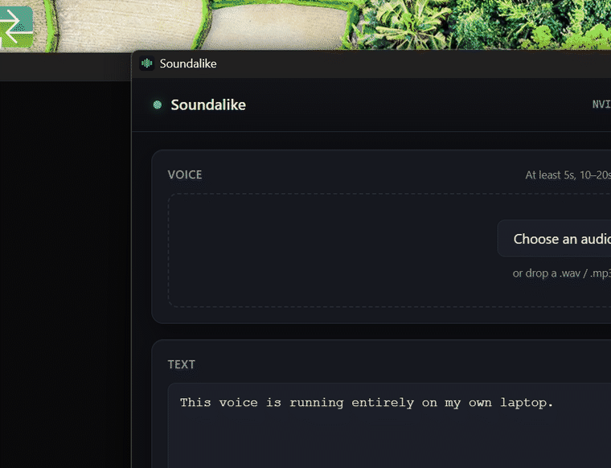

# Soundalike

**Clone a voice on your own machine. ~600 lines, one job, no Python for the user.**



## Read this first

If you want a full local voice studio, use **[jamiepine/voicebox](https://github.com/jamiepine/voicebox)** (47k★, MIT). It has 7 TTS engines, dictation, MCP integration, and voice personalities, and it is excellent. Soundalike does not compete with it and you should not pick this over it for features.

Soundalike exists for two narrower reasons:

1. **It is small.** One engine, one window, one job: drop in a voice, type, get audio. The whole app is about 600 lines of JavaScript and 300 of Python. If you want to read the entire thing in one sitting, or fork it into something else, that is easier here.
2. **It is a worked example of the packaging problem.** Shipping a CUDA PyTorch app as a Windows desktop app that a non-developer can install is genuinely awkward, and most projects solve it by telling the user to make a venv. The bootstrap here does it properly and the code is commented with the specific traps, which are not obvious and cost real time to find. See [How the packaging works](#how-the-packaging-works).

## Speed

Measured on an RTX 4070 Laptop (8GB), 7 seconds of generated speech, steady state after one warm-up pass. RTF is the multiple of realtime — lower is better.

| Checkpoint | Time for 7s of audio | RTF |
| ---------- | -------------------- | --- |
| turbo (default) | 9.5s | **1.19x** |
| base | 15.4s | 2.20x |

Longer inputs sit closer to realtime, since a fixed per-call cost is amortised over more audio. Reproduce with `python bench_turbo.py`. Do not benchmark on a 3-second string — per-call overhead dominates and you will measure 4.5x.

## What it does

- **Clones a voice from a short sample** — 5 seconds minimum, 10–20 works best.
- **Near-realtime on a laptop GPU** — 1.19x realtime on a mobile 4070.
- **Runs entirely offline** after setup. Nothing you type or record leaves the machine.
- **No web server.** Electron talks to the Python engine over a stdio pipe, so there is no port to collide, no firewall prompt, and no browser tab. "Offline" is a property of the architecture, not a promise.

## Status, honestly

Working and verified end to end on a clean machine: `npm run verify:setup:fresh`
provisions a fresh runtime and then generates real audio through the same stdio
protocol the app uses. Verified on the packaged build, not just in development —
the two share one app identity so they cannot provision to different places.

**First run took 38.6 minutes** on an unstable ~4MB/s connection and left a
5.8GB runtime. Faster links will be quicker; the download resumes across drops
rather than restarting, so a bad connection costs time, not failure.

The installer is **unsigned**, so SmartScreen will warn until there's a
certificate. Build from source if that bothers you.

## Build from source

```bash
git clone https://github.com/Manraj10/soundalike
cd soundalike
npm install
python -m venv .venv
./.venv/Scripts/python.exe -m pip install torch torchaudio --index-url https://download.pytorch.org/whl/cu124
./.venv/Scripts/python.exe -m pip install chatterbox-tts
npm start
```

If Electron's binary is missing, npm's allow-scripts policy blocked its postinstall — run `node install.js` inside `node_modules/electron` rather than loosening the policy.

Verify the engine without the UI:

```bash
npm run engine:test
```

Verify first-run provisioning against a clean runtime:

```bash
npm run verify:setup:fresh
```

## How it works

```
Electron UI  ──JSON over stdin/stdout──▶  Python engine  ──▶  Chatterbox (MIT)
```

One long-lived Python child. Requests and replies are newline-delimited JSON matched by id; progress events stream back while the model loads and generates.

## How the packaging works

The installer is 82MB. The ~5.8GB of Python, PyTorch and model weights is fetched once on first launch, behind a progress bar, into `%APPDATA%/soundalike/runtime`. Uninstalling removes it; a broken environment is fixed by deleting one folder; your system Python is never touched.

Five traps that cost real time, all commented in the source:

- **`pkg_resources` is missing from standalone Python.** python-build-standalone's `install_only` build ships without setuptools. Chatterbox's watermarker dependency imports `pkg_resources`, catches its own ImportError, and leaves the class as `None` — so it fails on the user's *first generate*, not at import. Invisible in development, because every venv has setuptools. And installing setuptools is not enough: **version 81 removed `pkg_resources`**, so you must pin `<81`.
- **A half-provisioned runtime must not look ready.** Checking that `python.exe` exists is not enough — an interrupted setup leaves an interpreter with no dependencies, and the app will skip setup and die on `ModuleNotFoundError` on every subsequent launch. Gate on a stamp written only after imports verify.
- **Windows ships `tar.exe`, but Git for Windows shadows it** with GNU tar, which parses `C:\...` as a remote host. Pin `%SystemRoot%\System32\tar.exe` by absolute path.
- **stderr must be drained continuously.** Library output is routed to stderr to keep stdout a clean protocol stream. Fill the ~4-8KB pipe buffer and the engine blocks on write — presenting as "a bit slow" with the GPU at 0%.
- **`torchaudio.save` defaults to float32**, which the Python stdlib `wave` module refuses and HTML5 `<audio>` handles inconsistently. Pass `encoding="PCM_S", bits_per_sample=16`.

## Limits

- **Windows only.** macOS and Linux are not built.
- **English only in this build.** The multilingual checkpoint (23 languages) is wired in the engine but not exposed in the UI.
- **Quality depends on your sample.** Ten seconds of clean, dry, single-speaker audio beats a minute of noisy podcast. Background music ruins it.
- **It does not verify consent.** See below.

## Consent

Cloning a voice is not a neutral act. Don't clone someone who hasn't agreed to it. Impersonation to commit fraud is a crime in most places, and "it was open source" is not a defense. This is for people making things with their own voice, or with a voice they have explicit permission to use.

## Credits

Speech synthesis by [Chatterbox](https://github.com/resemble-ai/chatterbox) from Resemble AI (MIT) — the hard part is theirs. Standalone Python builds from [astral-sh/python-build-standalone](https://github.com/astral-sh/python-build-standalone).

## License

MIT
